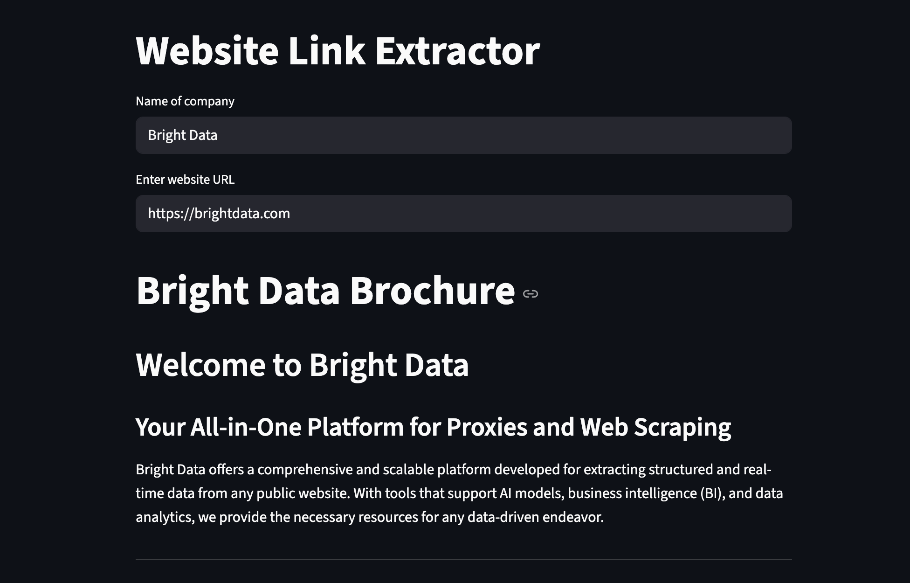

# 🧠 Website Brochure Generator with OpenAI & Streamlit

This project extracts relevant links and content from a company website, and generates a concise **company brochure** using OpenAI's GPT-4o-mini model.



Built with:
- 🐍 Python
- 🌐 Streamlit
- 🤖 OpenAI GPT
- 🧼 BeautifulSoup
- 🔐 Dotenv

---

## 📦 Features

- 🔍 Scrapes website content (title, body text, links)
- 🔗 Identifies relevant brochure links like **About**, **Careers**, etc.
- 🧠 Uses GPT to create a short **markdown brochure** from the website’s content
- ⚡ Clean UI powered by Streamlit

---

## 🚀 Getting Started

### 1. Clone the Repo

```bash
git clone https://github.com/Terieyenike/streamlit-brochure.git
cd streamlit-brochure
```

### 2. Install dependencies

```bash
pip install -r requirements.txt
```

### 3. Set your environment variables

Create a `.env` file in the root directory:

```bash
OPENAI_API_KEY=sk-proj-xxxxxxxxxxxxxxxxxxxxxxxxxxxx
```

> Must be a valid `sk-proj-` scoped API key.

### 4. Run the app

```bash
streamlit run app.py
```

### 🖥️ Usage

1. Enter a company name.

2. Paste the company’s website URL.

3. The app will:

    - Scrape content
    - Extract relevant links
    - Generate a markdown brochure

### 📁 Project Structure

```bash
├── app.py               # Main Streamlit app
├── .env                 # Environment file (not committed)
├── requirements.txt     # Dependencies
└── README.md            # Project documentation
```

### 📄 License

MIT License – feel free to use, fork, and build upon it.
